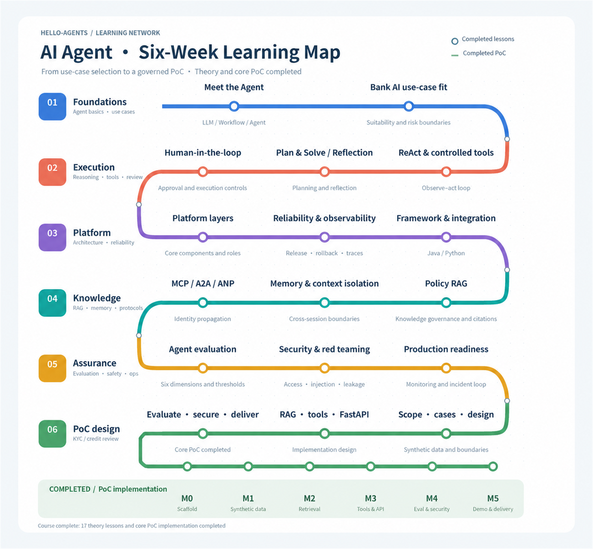

# AI Agent Learning — Datawhale Hello-Agents

[简体中文](./README.md) | [English](./README.en.md)

A personal learning project based on Datawhale's [Hello-Agents](https://github.com/datawhalechina/hello-agents) tutorial.

Learner profile: Java engineer and banking AI platform project manager, currently developing Python and data-analysis skills. This project follows a role-oriented, compressed six-week pathway covering Agent use-case selection, platform architecture, knowledge and access governance, security evaluation, and a controlled PoC.

## Learning Path

This repository brings together AI Agent study notes, engineering exercises, and a runnable PoC. A separate AI Platform PM development track complements this technical pathway with platform architecture, governance, delivery, and operational practices.

- **AI technical pathway:** [six-week plan](./bank-ai-platform-pm-6week-plan.md), with lessons under `week01/` through `week06/` and reusable deliverables under `artifacts/`.
- **Learning maps:** [Chinese PNG](./ai-agent-six-week-learning-map.png) · [English PNG](./ai-agent-six-week-learning-map-en.png). All 17 theory lessons and the core PoC implementation are complete; productionization remains a separate follow-up track.
- **AI Platform PM development:** [role-learning hub](https://github.com/gjnzsu/ai-platform/blob/main/platform-pm/README.md), including a 90-day roadmap, ways-of-working templates, anonymized practice, and weekly reviews.

### Six-Week Learning Map

## Course Materials

- [Compressed six-week learning plan](./bank-ai-platform-pm-6week-plan.md)
- [AI Platform PM: 90-day capability and ways-of-working roadmap](https://github.com/gjnzsu/ai-platform/blob/main/platform-pm/roadmap.md)
- [Week 1, Lesson 1: Agent fundamentals](./week01/lesson01-agent-fundamentals.md)
- [Week 1, Lesson 2: Banking AI scenario selection](./week01/lesson02-bank-ai-scenario-selection.md)
- [Week 2, Lesson 1: ReAct and controlled tool use](./week02/lesson01-react-and-controlled-tools.md)
- [Week 2, Lesson 2: Plan-and-Solve and Reflection](./week02/lesson02-plan-solve-reflection.md)
- [Week 2, Lesson 3: Human-in-the-loop and execution governance](./week02/lesson03-human-in-the-loop-execution-governance.md)
- [Week 3, Lesson 1: Platform layers and core components](./week03/lesson01-platform-layers-and-core-components.md)
- [Week 3, Lesson 2: Reliability, release management, and observability](./week03/lesson02-reliability-release-observability.md)
- [Week 3, Lesson 3: Framework selection and Java/Python integration](./week03/lesson03-framework-selection-java-python-integration.md)
- [Week 4, Lesson 1: Policy RAG and knowledge governance](./week04/lesson01-rag-and-knowledge-governance.md)
- [Week 4, Lesson 2: Memory, context, and cross-session isolation](./week04/lesson02-memory-context-isolation.md)
- [Week 4, Lesson 3: MCP, A2A, ANP, and identity propagation](./week04/lesson03-protocols-and-identity-propagation.md)
- [Week 5, Lesson 1: Banking Agent evaluation framework](./week05/lesson01-agent-evaluation-framework.md)
- [Week 5, Lesson 2: Agent security and red-team testing](./week05/lesson02-agent-security-red-team-testing.md)
- [Week 5, Lesson 3: Production readiness, monitoring, and operations](./week05/lesson03-production-readiness-monitoring-operations.md)
- [Week 6 integrated plan: KYC/credit-document review Agent PoC](./week06/week06-unified-rag-learning-plan.md)
- [Week 6, Lesson 1: PoC scope, synthetic Case data, and architecture](./week06/lesson01-poc-scope-data-architecture.md)
- [Week 6, Lesson 2: RAG, validation tools, and FastAPI](./week06/lesson02-rag-tools-fastapi.md)
- [Week 6, Lesson 3: Evaluation, security, observability, and delivery](./week06/lesson03-evaluation-security-observability-delivery.md)
- [PoC implementation workbook](./week06/poc-implementation-workbook.md)
- [Runnable KYC Review Agent PoC](./projects/kyc-review-agent/README.md)

## Core Artifacts

These reusable deliverables were distilled from the course and PoC for design reviews, implementation planning, and portfolio presentation:

- [Banking Agent use-case assessment](./artifacts/01-agent-use-case-assessment.md)
- [Tool and human-in-the-loop control matrix](./artifacts/02-tool-and-hitl-control-matrix.md)
- [Banking Agent platform logical architecture](./artifacts/03-agent-platform-architecture.md)
- [KYC Review Agent evaluation scorecard](./artifacts/04-agent-evaluation-scorecard.md)

## Completion Status

- [x] Week 1: Agent fundamentals and banking AI use-case selection
- [x] Week 2: ReAct, Plan-and-Solve, Reflection, and human-in-the-loop governance
- [x] Week 3: Platform architecture, reliability, observability, and Java/Python integration
- [x] Week 4: Policy RAG, memory, context isolation, MCP, A2A, ANP, and identity propagation
- [x] Week 5: Evaluation, security, red teaming, production readiness, and operations
- [x] Week 6: PoC scope, architecture, RAG, controlled tools, FastAPI, evaluation, and delivery
- [x] Core PoC: synthetic data, policy retrieval, deterministic validation, LLM-assisted drafting, citation validation, safe fallback, FastAPI, automated tests, and five demo Cases
- [ ] Pilot and production extensions: Docker, complete tracing, formal red-team execution, performance and cost baselines, a Release Bundle, and a signed Go/No-Go report

## PoC Verification

The completed core PoC currently demonstrates:

- 50 passing automated tests;
- 3 retrieval evaluation Cases with `Precision@1 = 1.0` and `Recall@1 = 1.0`;
- 5 passing repeatable demo Cases: complete materials, missing address proof, expired material, cross-document conflict, and safe fallback after an LLM failure.

These results use a small synthetic dataset. They demonstrate that the PoC workflow is runnable and testable, but they do not constitute Pilot or production approval.
