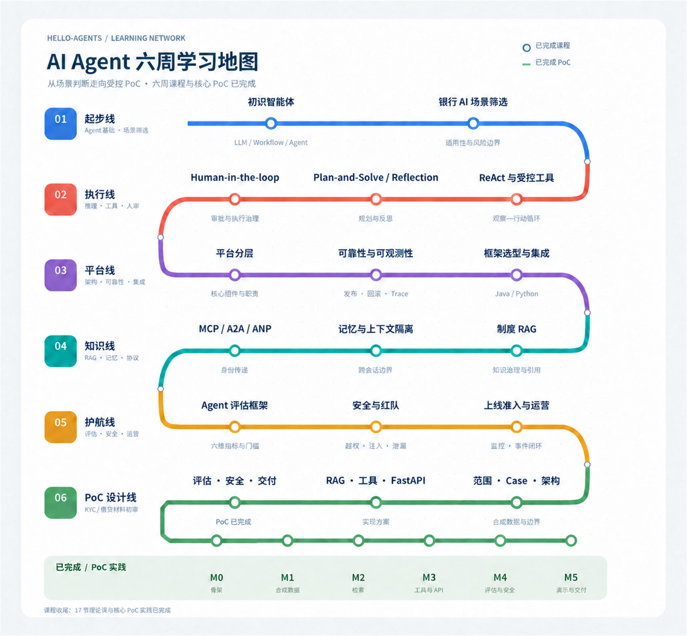

# AI Agent Learning — Datawhale Hello-Agents

[简体中文](./README.md) | [English](./README.en.md)

基于 Datawhale [Hello-Agents](https://github.com/datawhalechina/hello-agents) 教程整理的个人学习项目。

学习者背景：Java Engineer、银行 AI 平台项目经理，正在学习 Python 与数据分析。本项目采用面向实际岗位的六周压缩路线，重点关注 Agent 场景判断、平台架构、知识与权限治理、安全评估及受控 PoC。

## 学习路线导航

本仓库聚焦 AI Agent 技术学习、代码练习和 PoC。银行 AI 平台 PM 成长计划已迁移至 ai-platform 仓库，两条路线通过平台架构、治理、评估和生产运营知识相互衔接。

- **AI 技术学习**：[六周计划](./bank-ai-platform-pm-6week-plan.md)，课程位于 `week01/` 至 `week06/`，成果位于 `artifacts/`。
- **六周学习地图**：[中文版 PNG](./ai-agent-six-week-learning-map.png) · [English PNG](./ai-agent-six-week-learning-map-en.png)。17 节理论课与核心 PoC 实践均已完成；生产化扩展单独列入后续路线。
- **平台 PM 能力发展**：[岗位学习导航](https://github.com/gjnzsu/ai-platform/blob/main/platform-pm/README.md)，包含 90 天路线图、WoW 模板、匿名化实践和每周复盘。

### 六周学习路径

## 学习资料

- [六周压缩学习计划](./bank-ai-platform-pm-6week-plan.md)
- [集团 AI 平台 PM：90 天能力发展与 Ways of Working 路线图](https://github.com/gjnzsu/ai-platform/blob/main/platform-pm/roadmap.md)（与技术学习并行，覆盖 backlog、交付透明度及 adoption 实践）
- [第一周第一课：初识智能体](./week01/lesson01-agent-fundamentals.md)
- [第一周第二课：银行 AI 场景筛选与 Agent 适用性判断](./week01/lesson02-bank-ai-scenario-selection.md)
- [第二周第一课：ReAct 与受控工具调用](./week02/lesson01-react-and-controlled-tools.md)
- [第二周第二课：Plan-and-Solve 与 Reflection](./week02/lesson02-plan-solve-reflection.md)
- [第二周第三课：Human-in-the-loop 与执行治理](./week02/lesson03-human-in-the-loop-execution-governance.md)
- [第三周第一课：银行 Agent 平台分层与核心组件](./week03/lesson01-platform-layers-and-core-components.md)
- [第三周第二课：可靠性、发布管理与可观测性](./week03/lesson02-reliability-release-observability.md)
- [第三周第三课：框架选型与 Java/Python 集成](./week03/lesson03-framework-selection-java-python-integration.md)
- [第四周第一课：银行制度 RAG 与知识治理](./week04/lesson01-rag-and-knowledge-governance.md)
- [第四周第二课：记忆、上下文与跨会话隔离](./week04/lesson02-memory-context-isolation.md)
- [第四周第三课：MCP、A2A、ANP 与身份传递](./week04/lesson03-protocols-and-identity-propagation.md)
- [第五周第一课：银行 Agent 评估框架](./week05/lesson01-agent-evaluation-framework.md)
- [第五周第二课：Agent 安全与红队测试](./week05/lesson02-agent-security-red-team-testing.md)
- [第五周第三课：Agent 上线准入、监控与运营闭环](./week05/lesson03-production-readiness-monitoring-operations.md)
- [第六周综合学习计划：KYC/信贷材料初审辅助 Agent PoC](./week06/week06-unified-rag-learning-plan.md)
- [第六周第一课：PoC 范围、合成 Case 数据与架构](./week06/lesson01-poc-scope-data-architecture.md)
- [第六周第二课：RAG、材料校验工具与 FastAPI](./week06/lesson02-rag-tools-fastapi.md)
- [第六周第三课：评估、安全、可观测性与交付](./week06/lesson03-evaluation-security-observability-delivery.md)
- [PoC 实践讲义：KYC/信贷材料初审辅助 Agent](./week06/poc-implementation-workbook.md)
- [PoC 实践：KYC/信贷材料初审辅助 Agent](./projects/kyc-review-agent/README.md)

## 核心成果 Artifacts

以下成果物从学习讲义和 PoC 实践中提炼，用于方案评审、PoC 设计和面试展示。课程已完成可执行检索评估、自动化测试和五个演示场景；正式红队、准入报告与生产发布仍属于 Pilot/生产化工作。

- [银行 Agent 场景评估](./artifacts/01-agent-use-case-assessment.md)
- [Tool 与 Human-in-the-loop 控制矩阵](./artifacts/02-tool-and-hitl-control-matrix.md)
- [银行 Agent 平台逻辑架构](./artifacts/03-agent-platform-architecture.md)
- [KYC Review Agent Evaluation Scorecard](./artifacts/04-agent-evaluation-scorecard.md)

## 当前进度

- [x] 第一周第一课：初识智能体（2026-09-01 完成）
- [x] 区分 LLM、Workflow 与 Agent
- [x] 理解目标、环境、感知、工具、行动和完成条件
- [x] 识别数据质量、计算准确性和工具权限风险
- [x] 第一周第二课：银行 AI 场景筛选与 Agent 适用性判断（2026-09-02 完成）
- [x] 第二周第一课：ReAct 与受控工具调用（2026-09-04 完成）
- [x] 第二周第二课：Plan-and-Solve 与 Reflection（2026-09-06 完成）
- [x] 第二周第三课：Human-in-the-loop 与执行治理（2026-09-06 完成）
- [x] 第三周第一课：银行 Agent 平台分层与核心组件（2026-09-08 完成）
- [x] 第三周第二课：可靠性、发布管理与可观测性（2026-09-09 完成）
- [x] 第三周第三课：框架选型与 Java/Python 集成（2026-09-10 完成）
- [x] 第四周第一课：银行制度 RAG 与知识治理（2026-09-10 完成）
- [x] 第四周第二课：记忆、上下文与跨会话隔离（2026-09-11 完成）
- [x] 第四周第三课：MCP、A2A、ANP 与身份传递（2026-09-12 完成）
- [x] 第五周第一课：银行 Agent 评估框架（2026-09-14 完成；检索评估已在 PoC 落地）
- [x] 第五周第二课：Agent 安全与红队测试（2026-09-18 完成；安全降级与关键防护测试已在 PoC 落地）
- [x] 第五周第三课：Agent 上线准入、监控与运营闭环（2026-09-19 完成；正式 Pilot 准入待后续）
- [x] 第六周第一课：PoC 范围、合成 Case 数据与架构（2026-09-20 完成）
- [x] 第六周第二课：RAG、材料校验工具与 FastAPI（2026-09-22 完成；代码与测试已落地）
- [x] 第六周第三课：评估、安全、可观测性与交付（2026-09-23 完成；核心评估与演示已落地）
- [x] PoC 核心实践：完成合成数据、制度检索、确定性校验、LLM 草稿、引用验证、安全降级、FastAPI、自动化测试与五个演示 Case（2026-09-27 完成）
- [ ] Pilot/生产化扩展：Docker、完整 Trace、正式红队、性能与成本基线、Release Bundle 和 Go/No-Go 准入报告

六周课程与核心 PoC 已完成。最终验证结果为 50 项自动化测试通过、3 条检索评估 Case 的 Precision@1 与 Recall@1 均为 1.0、5 个固定演示 Case 全部通过。上述数字来自小规模合成数据，只证明 PoC 链路可运行，不代表生产准入结论。
