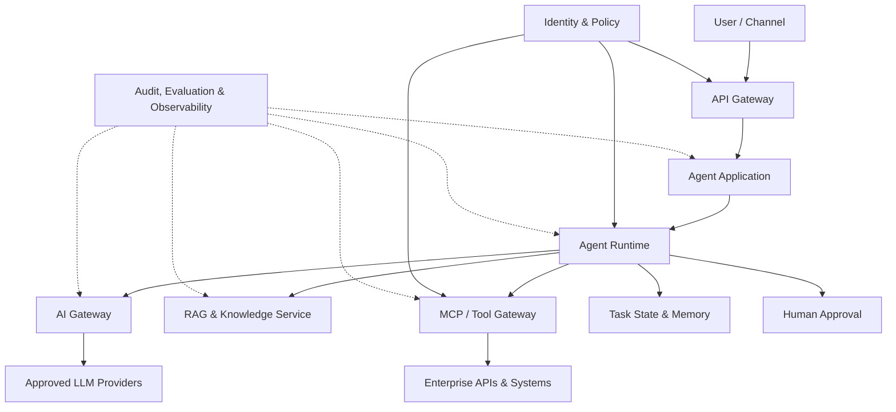

# Artifact 03：银行 Agent 平台逻辑架构

## 文档信息

- Status：Draft v0.1
- Owner：AI Platform Product / Delivery
- Purpose：定义银行 Agent 平台的逻辑分层、组件职责、请求路径和治理边界
- Decision stage：Architecture discovery / PoC design
- Source lessons：
  - [第三周第一课：银行 Agent 平台分层与核心组件](../week03/lesson01-platform-layers-and-core-components.md)
  - [第三周第二课：可靠性、发布管理与可观测性](../week03/lesson02-reliability-release-observability.md)
  - [第三周第三课：框架选型与 Java/Python 集成](../week03/lesson03-framework-selection-java-python-integration.md)
  - [第四周第一课：银行制度 RAG 与知识治理](../week04/lesson01-rag-and-knowledge-governance.md)
  - [第四周第二课：记忆、上下文与跨会话隔离](../week04/lesson02-memory-context-isolation.md)
  - [第四周第三课：MCP、A2A、ANP 与身份传递](../week04/lesson03-protocols-and-identity-propagation.md)
- Planned Week 5 update：补充 Evaluation Service、上线门禁、红队测试和运营指标
- Last updated：2026-09-14

## 1. Purpose

本 Artifact 用于对齐业务、架构、工程、风险和运营团队对 Agent 平台的理解。它回答：

- 用户请求如何进入 Agent 应用；
- Agent Runtime 与 LLM、RAG、Memory、Tool 的关系；
- API Gateway 与 AI Gateway 为什么不是同一个组件；
- 身份和权限如何传递到企业系统；
- 哪些状态属于 Agent，哪些必须保存在正式业务系统；
- 如何实现发布、审计、可观测和失败降级。

## 2. Architecture principles

1. **Security first**：身份、权限和数据策略必须在确定性控制层执行。
2. **Least privilege**：模型只看到当前任务允许的知识和工具。
3. **Separation of concerns**：应用接入、Agent 编排、模型访问和工具访问分层治理。
4. **Human accountability**：高风险业务决定由授权人员承担最终责任。
5. **System of Record**：正式客户、Case、交易和审批状态保存在业务系统。
6. **Version everything**：模型、Prompt、Agent、RAG、工具和策略均可追溯。
7. **Observable by design**：请求、检索、工具、模型、审批和成本可关联追踪。
8. **Progressive autonomy**：从建议型开始，依据评估和风险批准逐步扩大执行权限。

## 3. High-level logical architecture



图中虚线表示 Telemetry、审计和评估数据采集，不代表业务请求必须同步经过一个中央监控组件。

## 4. Platform layers

| Layer | Components | Responsibility |
|---|---|---|
| Experience | Web、staff channel、API client | 收集用户目标、展示引用、审批和任务状态 |
| Access | API Gateway、WAF、rate limit | 应用认证、入口授权、流量与 API 防护 |
| Application | Agent Application | 场景 UX、业务范围、Prompt 和完成条件 |
| Orchestration | Agent Runtime、workflow、task state | 规划、工具选择、状态机、停止和接管 |
| AI access | AI Gateway、model registry | 模型抽象、路由、配额、内容策略和成本 |
| Knowledge | ingestion、RAG、reranker | 知识版本、权限过滤、检索和引用 |
| Tool integration | MCP client/server、Tool Gateway | 工具发现、Schema、细粒度授权和执行 |
| State | conversation、task state、memory | 保存任务进度、允许的上下文和用户偏好 |
| Governance | IAM、Policy、HITL、audit | 身份、权限、审批、数据和合规控制 |
| Operations | telemetry、evaluation、release | SLO、成本、质量、版本比较和回滚 |
| Foundation | Kubernetes/GKE、model endpoints、databases | 运行、伸缩、网络、存储和基础安全 |

## 5. Component responsibilities

### 5.1 API Gateway

负责：

- Client 和 Channel 接入；
- TLS、WAF、流量限制和 API 配额；
- 应用认证和基础授权；
- Request ID、Trace ID 和路由；
- API 生命周期与外部契约。

不负责：

- Agent 任务规划；
- 根据业务任务选择 LLM；
- RAG 检索逻辑；
- 模型 Prompt 和生成参数管理。

### 5.2 Agent Application

负责：

- 特定业务场景和用户体验；
- 将用户请求转换成明确任务；
- 定义 In scope、完成条件和拒绝边界；
- 组织 Prompt、工具和知识配置；
- 展示证据、任务状态和人工审批；
- 将正式业务动作交给受控 Workflow 或业务服务。

### 5.3 Agent Runtime

负责：

- 创建和管理 Task；
- 维护 Agent 状态机；
- 调用模型获得计划或下一步；
- 在授权工具集合中选择并执行工具；
- 根据 Observation 更新任务；
- 控制最大步骤、时间、Token 和委派深度；
- 触发 Reflection、降级、停止或人工接管；
- 关联全链路 Trace。

Agent Runtime 调用 LLM，而不是 LLM 在平台外部主动触发 Runtime。

### 5.4 AI Gateway

负责：

- 统一连接云端和本地模型；
- 模型注册、路由和 Provider abstraction；
- 应用/用户/用例配额；
- 输入输出策略和 Guardrail；
- Token、延迟、错误和费用统计；
- 模型版本切换、降级和熔断。

推荐调用关系：

```text
User → API Gateway → Agent Application / Runtime
Runtime → AI Gateway → Selected LLM
```

用户访问 Agent 应用不必先经过 AI Gateway。AI Gateway 主要位于 Runtime 到模型的调用路径。

### 5.5 RAG & Knowledge Service

负责：

- 文档采集、切分、Embedding 和索引；
- 文档版本、有效期、Owner 和密级；
- 在检索前执行用户、机构和用途过滤；
- Hybrid retrieval 和 reranking；
- 返回来源、版本和可引用片段；
- 处理知识失效、撤回和重建索引。

RAG 返回内容是外部上下文，不能覆盖 System Policy，也不能被默认视为可信指令。

### 5.6 MCP / Tool Gateway

负责：

- 注册和发现批准的工具；
- Tool Schema 与版本管理；
- 能力暴露前过滤；
- 参数验证和具体调用授权；
- 身份委派、短期凭证和 Audience 绑定；
- 限流、超时、重试、幂等和结果过滤；
- 工具调用审计与紧急禁用。

MCP 是交互协议，Tool Gateway 是治理和执行控制层，两者可以组合但不能互相替代。

### 5.7 State and Memory

区分三类状态：

| Type | Purpose | Example | System of Record |
|---|---|---|---|
| Conversation context | 当前对话理解 | 最近消息、摘要 | Agent store |
| Task state | 多步任务执行 | 当前步骤、工具结果、pending approval | Runtime/task store |
| User memory | 经批准的长期偏好 | 语言、展示偏好 | Governed memory store |
| Business state | 正式业务事实 | Case status、payment status、approval | Enterprise system |

Memory 必须按用户、机构、应用和环境隔离，设置用途、保留期和删除机制。

### 5.8 Identity & Policy

负责校验：

- 最终用户；
- Client Application；
- Agent Workload 与版本；
- 下游 Resource；
- 当前任务 Purpose；
- 数据和字段范围。

最终权限是多项权限的交集，而不是 Agent 服务账号的最大权限。

### 5.9 Human Approval

负责：

- 行动前审批；
- 执行中接管；
- 结果后复核；
- 记录 Approver、决定、修改和时间；
- 将批准的具体 Action 交给正式执行服务。

### 5.10 Audit, Evaluation & Observability

负责：

- 请求、检索、模型、工具和审批 Trace；
- 服务 SLI/SLO 和错误分类；
- Token、模型费用和预算；
- 任务成功率、工具正确率和人工接管率；
- Model/Prompt/RAG/Tool/Policy 版本关联；
- 离线评估、回归比较和上线门禁。

Week 5 完成后，本节将补充详细评估架构和 Hard Gate。

## 6. End-to-end request flow

以 KYC Auditor 查询并生成审核建议为例：

1. Auditor 登录 KYC Copilot。
2. 请求经 API Gateway 完成应用认证、限流和入口授权。
3. Agent Application 校验场景范围并创建任务。
4. Runtime 生成 `task_id` 和 `trace_id`，加载受隔离的 Task State。
5. Policy Service 根据用户、应用和任务过滤可用知识与工具。
6. Runtime 通过 AI Gateway 调用已批准模型，获得结构化下一步建议。
7. 如需制度信息，RAG 先执行权限和有效期过滤，再检索与重排。
8. 如需 AML 信息，Runtime 选择 `get_aml_report` 并生成结构化参数。
9. Runtime 校验 Schema、Case 绑定和任务状态。
10. Policy Service 对具体用户、Agent、工具、Case 和用途授权。
11. 身份服务签发面向 AML 服务的短期委派凭证。
12. MCP/Tool Gateway 调用企业 API，验证结果并执行字段最小化。
13. Runtime 把工具结果作为不可信数据处理，再交给模型生成建议。
14. 系统检查引用、完成条件和风险等级。
15. Auditor 复核结果；必要时编辑、拒绝或要求补充。
16. 如需更新正式 Case，受控业务 Workflow 使用批准 Action 调用 System of Record。
17. 全链路写入结构化审计和 Telemetry，但不保存凭证或无必要敏感正文。

## 7. Java 与 Python 集成边界

推荐保持现有 Java 业务能力和 Python Agent 能力的职责边界：

```text
Java business services
- 客户、Case、权限和正式状态
- 确定性业务规则
- 事务、幂等和审计契约
          ↑ API / Event
Python Agent service
- LLM integration
- Agent planning and orchestration
- RAG and framework adapters
- Evaluation and experimentation
```

关键原则：

- Python Agent 不直接绕过 Java 业务服务访问生产数据库；
- Java 服务不依赖模型输出执行未经校验的高风险动作；
- 接口使用结构化 Schema、明确错误码和版本；
- 长任务使用 Task/Status 或 Event 模式，不依赖无限同步等待；
- Trace ID、User context 和授权目的跨语言传递。

## 8. Reliability and release controls

| Area | Required control |
|---|---|
| Timeout | 分别定义模型、RAG、工具和端到端任务超时 |
| Retry | 只重试安全操作；写操作先查状态并使用幂等键 |
| Circuit breaker | 模型或工具连续失败时快速降级 |
| Fallback | 模型降级、缓存结果、只返回来源或转人工 |
| Budget | 限制步骤、工具调用、Token、时间和委派深度 |
| Version | 固定 Agent、Model、Prompt、RAG、Tool、Policy 版本 |
| Deployment | Dev/Test/Prod 隔离，灰度发布和快速回滚 |
| Kill switch | 可按 Agent、模型、工具或版本紧急禁用 |
| State recovery | 长任务支持恢复、取消和人工接管 |
| Contract test | 验证 API、Tool Schema、错误码和副作用变化 |

## 9. Observability model

### 9.1 Trace hierarchy

```text
request_id
└─ task_id / trace_id
   ├─ model_call
   ├─ retrieval
   ├─ tool_call
   ├─ delegated_task
   ├─ policy_decision
   └─ human_approval
```

### 9.2 Core telemetry

| Category | Metrics |
|---|---|
| Business | task success、processing time、adoption |
| Agent | step count、loop rate、stop reason |
| Model | latency、tokens、cost、error、selected model |
| RAG | retrieval hit、citation、data version |
| Tool | success、P95 latency、retry、authorization denial |
| HITL | takeover、approval、reject、edit |
| Security | injection、unauthorized request、data leakage |
| Platform | availability、capacity、deployment and rollback |

## 10. Data and trust boundaries

| Boundary | Main risk | Control |
|---|---|---|
| User → Application | 恶意或越权请求 | 认证、输入校验、场景范围 |
| Runtime → Model | 敏感数据外发 | 数据最小化、批准模型、AI Gateway |
| Knowledge → Runtime | 过期或恶意内容 | 权限、版本、来源、不可信输入隔离 |
| Runtime → Tool | 错误参数或权限放大 | 两阶段授权、Schema、Policy |
| Tool → Runtime | 工具投毒或敏感字段 | 结果校验、脱敏、字段过滤 |
| Agent → Agent | 委派放大和循环 | 衰减权限、最大深度、任务预算 |
| Agent → Human | 自动化偏见 | 证据展示、风险提示、有效复核 |
| Agent → System of Record | 未批准状态改变 | Workflow、审批、正式服务授权 |

## 11. Key architecture decisions

| Decision | Rationale |
|---|---|
| API Gateway 位于 Agent 应用入口 | 负责 Channel/API 接入和流量安全 |
| AI Gateway 位于 Runtime 到模型之间 | 统一模型路由、策略、配额和成本 |
| Agent Runtime 负责调用模型和工具 | Runtime 是任务状态和执行控制主体 |
| Tool Gateway 执行确定性授权 | 不把权限决定交给模型 |
| RAG 在检索前做权限过滤 | 防止先检索后泄漏 |
| Business state 保留在正式系统 | Memory 不作为业务事实来源 |
| 高风险动作通过 HITL 和 Workflow | 保留责任、审批和可审计性 |
| Java 与 Python 通过契约集成 | 保持业务确定性和 Agent 迭代速度 |
| 所有关键组件版本化 | 支持复现、回归和回滚 |
| 从 L1 建议辅助开始 | 依据评估结果逐步提升自主性 |

## 12. Architecture review checklist

- [ ] 每个组件有明确 Owner 和职责边界。
- [ ] API Gateway 与 AI Gateway 的调用位置已明确。
- [ ] 用户、应用、Agent 和下游身份可区分并关联。
- [ ] RAG 权限在检索前执行。
- [ ] Tool Schema、授权和执行治理相互独立。
- [ ] Conversation、Task、Memory 和 Business State 已分离。
- [ ] 高风险动作具有审批、幂等和正式执行路径。
- [ ] 超时、重试、降级、预算、回滚和 Kill Switch 已设计。
- [ ] Trace 能关联模型、检索、工具、委派和人工环节。
- [ ] 生产数据不会进入未批准模型、日志或 Memory。
- [ ] Java/Python 接口具有版本化 Schema 和错误契约。
- [ ] 架构可支持离线评估、灰度和持续运营。

## 13. Future updates

完成 Week 5 后补充：

- Evaluation Service 的数据流和职责；
- 离线评估集、LLM Judge 和人工评审的位置；
- Prompt Injection、工具投毒和数据泄漏测试；
- Hard Gate 与 release pipeline 的关系；
- Model/Prompt/RAG/Tool 版本对比；
- 线上漂移、反馈回流和准入/回滚阈值。
